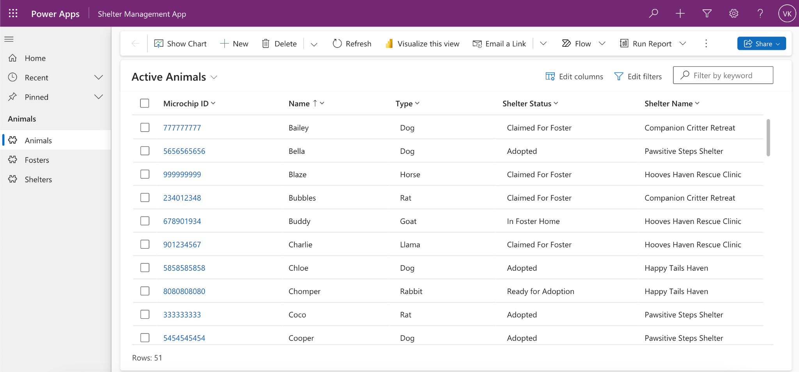
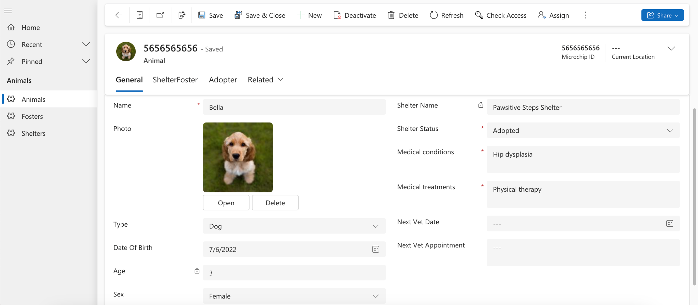
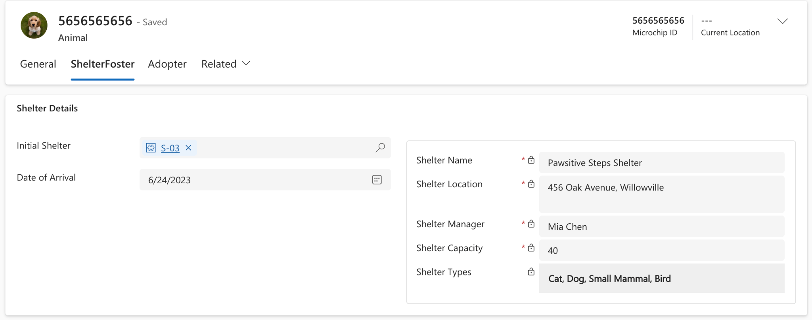
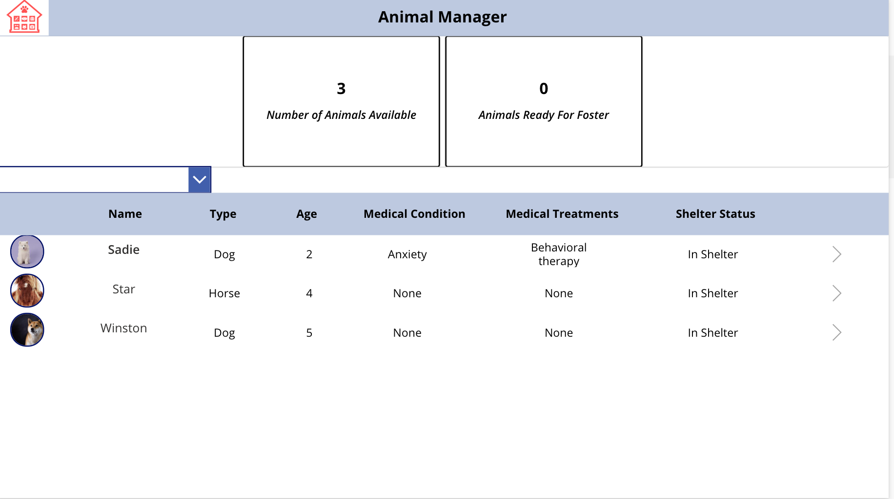
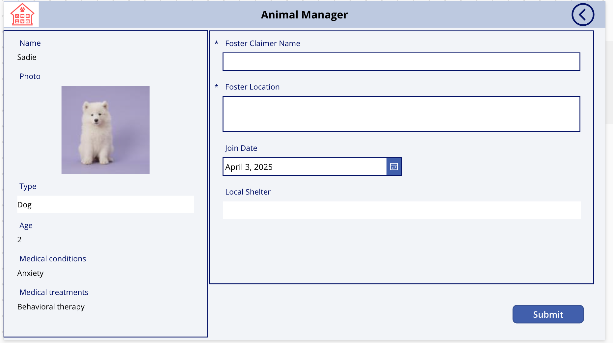
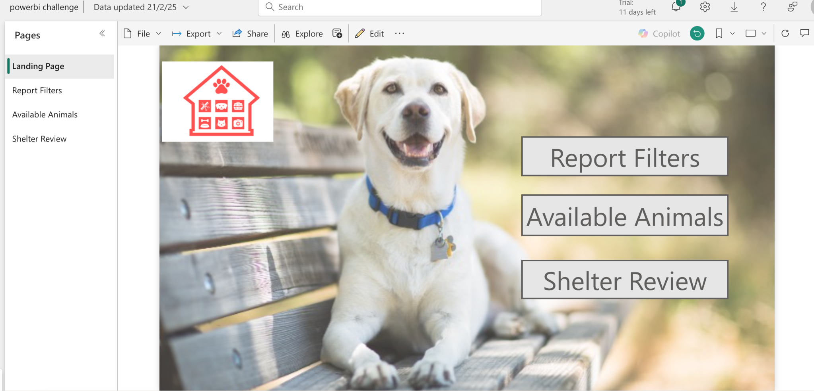
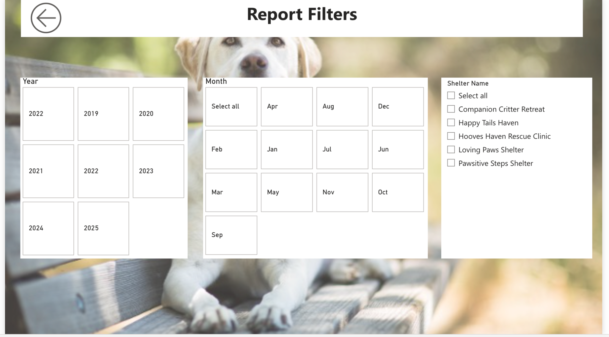
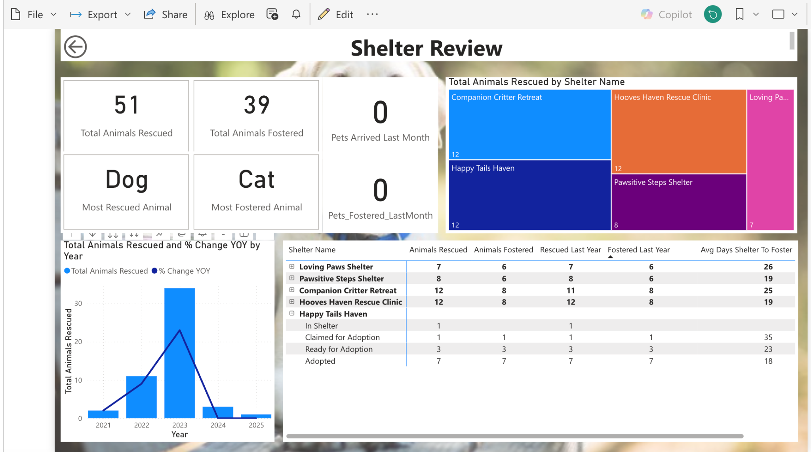

# 🐾 Animal Shelter CRM – Power Platform Solution

This is a full-featured solution built as part of the Microsoft Power Up Challenge to help an animal shelter manage pet fostering and care operations.

## 💡 Overview

This solution uses:
- Power Apps (Canvas & Model-Driven)
- Power Automate
- Dataverse
- Power BI

## 🚀 Features

- Canvas App: For foster families to view and claim pets
- Model-Driven App: For shelter staff to manage pet records
- Power Automate: Sends notifications when pets are fostered
- Power BI: Reports on pet status, trends, and adoptions

## 🛠️ Technologies Used

- Power Apps (Canvas + Model-Driven)
- Power Automate
- Dataverse
- Power BI
- Dynamics 365 (optional backend)
- YAML pipelines for deployment (planned)

## 📸 Screenshots

### Model-Driven App – Animal Management

### Canvas App – Foster Management

### Power BI Dashboard

## 📂 Folder Structure

- `/screenshots`: UI screenshots
- `/automate-flows`: exported .zip or JSON of your flows
- `/power-bi-report`: PBIX or report visuals
- `/power-apps-schemas`: Dataverse table schema images

# 🗃️ Power apps Schemas – Animal Shelter CRM

This folder contains the data model (schema) and relationships used in the Animal Shelter CRM solution.

## 📦 Tables

### 🐶 Animal Table
- Fields: Name, Microchip ID, Type, Age, Medical Info, Shelter Status
- Relationships:
  - Lookup to Foster (Foster Claimer)
  - Lookup to Shelter (Initial Shelter)
  - Lookup to Adopter

📸 See: `animal-table-schema.png` and `animal-relationships.png`

---

### 🏠 Foster Table
- Fields: Claimer Name, Location, Join Date
- Relationships:
  - Lookup to Animal (Foster Claimer)
  - Lookup to Shelter (Local Shelter)

📸 See: `foster-table-schema.png` and `foster-relationships.png`

---

### 🏥 Shelter Table
- Fields: Shelter Name, Manager, Capacity, Location, Types Supported
- Relationships:
  - One-to-Many with Animals and Fosters

📸 See: `shelter-table-schema.png` and `shelter-relationships.png`

---

These tables were created in Microsoft Dataverse and used in Power Apps, Power Automate, and Power BI components of the full solution.

## 📽️ Demo

Video submission (Power Up Challenge): https://youtu.be/wQfPXLpGdgw

## 📌 About

Built by [Venkata Kalyani Vemula](https://www.linkedin.com/in/venkata-kalyani-vemula-507247210)
